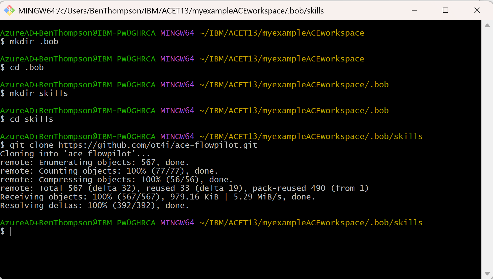

# ace-flowpilot
This repository provides skill guidance for IBM App Connect Enterprise (ACE) Toolkit users. It combines:
- Setup instructions for running the ace-flowpilot skill inside ACE Toolkit
- Focused skills for creating and explaining ACE artifacts
- Shared ACE reference material for projects, node types, policies, ESQL, and JavaCompute

## Who this repository is for
Use this repository if you want your AI Agent (such as IBM Bob Shell or GitHub Copilot) to help with ACE Toolkit assets such as:
- Message flows (`.msgflow`)
- ESQL (`.esql`)
- JavaCompute classes (`.java`)
- Connector-based flows and related policy files

## Quick start
1. Install your AI Agent (such as IBM Bob Shell). If you are using ACE Toolkit 13.0.9.0 or later, GitHub Copilot is already installed)
2. Configure ACE Toolkit to launch the IBM Bob Shell in your Eclipse workspace.
3. If you are using ACE Toolkit 13.0.9.0 or later, the skills in this repository are automatically downloaded into the `.bob\skills` and `.github\skills` folders in your Toolkit workspace.
4. Set up the IBM Bob Shell as a Terminal option in ACE Toolkit (instructions below).

## What this repository provides
- ACE Toolkit setup guidance
- Focused ACE skills under [`skills/`](skills)
- Shared ACE guidance under [`skills/shared/`](skills/shared)
- Connector-specific guidance under [`skills/shared/connectors/`](skills/shared/connectors)
- Legacy root-level compatibility stubs for earlier connector file paths

## Installing IBM Bob Shell
The ACE Toolkit runs on Windows, Linux, or MacOS. For the most up to date information (IBM Bob changes its install mechanism from time to time), find detailed instructions for installing IBM Bob Shell on each of these platforms [here](https://bob.ibm.com/docs/shell/getting-started/install-and-setup).

On Windows, you can install IBM Bob Shell using this command:
```powershell -ep Bypass "iwr https://bob.ibm.com/download/bobshell.ps1 -OutFile $env:TMP\bob.ps1; &$env:TMP\bob.ps1"```

On Linux, you can install IBM Bob Shell using this command:
```curl -fsSL https://bob.ibm.com/download/bobshell.sh | bash```

On MacOS, you can install IBM Bob Shell using this command:
```curl -fsSL https://bob.ibm.com/download/bobshell.sh | bash```

## Running IBM Bob Shell in ACE Toolkit

1. Start the ACE Toolkit and if running on Windows or Linux, from the Toolkit's Window menu choose Preferences. If you're running on MacOS then the menu is named Settings instead of Preferences. When the Preferences pop-up opens navigate to the section **Terminal > Local Terminal** and click the **Add** button on the right-hand side of the window:

   

2. In the resulting dialog provide the following details and then click the **Add** button:

   - Name = **IBM Bob Shell**
   - Path = **C:\Users\YourUserName\AppData\Roaming\npm\Bob.cmd**
  
   <br/>The Path will vary depending on your platform. You can run the ```which bob``` command to help you locate the correct path. On MacOS this will be ```/Users/YourUserName/Library/pnpm/bin/bob```.
   <br />
   

3. Control will return to the previous Preferences window. From the drop-down menu change the Initial Working Directory to **Eclipse workspace** and then click the **Apply and Close** button.

   

4. From the **Window** menu, choose **Preferences** again. When the **Preferences** window opens, use the filter to navigate to the section **Terminal**. From the **Presets** drop-down, select **Eclipse Dark** and click the **Apply and Close** button:

   

5. From the top toolbar in the Toolkit, click the **Terminal** shortcut shown in the red box below:

   

6. From the Launch Terminal pop-up, select **IBM Bob Shell** from the **Choose terminal** drop-down and click **OK**:

   

7. An IBM Bob Shell Terminal will open. By default it will be located at the bottom of the screen:

   

8. Scroll down and on first use you will be presented with a dialog to accept the IBM Bob license:

   

9. Next you will be asked to trust the folder. Due to the earlier setup, IBM Bob's workspace matches the ACE Toolkit Eclipse workspace directory. This makes it easier to use IBM Bob to interact with ACE Toolkit files in the local workspace.

   

10. If you have already been using IBM Bob then it may ask you to trust other directories as well. Once you have made these decisions, IBM Bob Shell will be ready to respond to queries as shown below:

   

## Installing the ACE Flow Pilot skills into `.bob/skills`
If you are planning to use IBM Bob Shell in the ACE Toolkit, and if you are using ACE 13.0.9.0 or later, then by default when Toolkit is launched, ACE will automatically place the ace-flowpilot skill into the right filesystem location (`<your ACE Toolkit workspace>/.bob/skills/ace-flowpilot`).

If you are using an earlier ACE version then you will need to clone the ace-flowpilot repository onto your local file system yourself.

The earlier configuration steps target your ACE Toolkit workspace as the IBM Bob project root directory. To make skills available for IBM Bob Shell in this context, navigate to this ACE Toolkit workspace and, if it does not already exist, create a folder called `.bob/skills`.

Clone this repository into the `.bob/skills` folder of your ACE Toolkit workspace as shown below:



If you want to use IBM Bob across multiple ACE Toolkit workspaces, you might prefer to define ACE skills globally in your user's home directory. 

## Repository structure
The repository is organized around the [`skills/`](skills) directory:

- [`skills/ace-message-flow/`](skills/ace-message-flow) contains the Bob skill for generic ACE Toolkit `.msgflow` creation
- [`skills/ace-connector-flows/`](skills/ace-connector-flows) contains the Bob skill for connector-based ACE flows
- [`skills/ace-project-setup/`](skills/ace-project-setup) contains the Bob skill for ACE Toolkit application and policy project scaffolding
- [`skills/ace-esql/`](skills/ace-esql) contains the Bob skill for ACE ESQL generation and refinement
- [`skills/ace-java-compute/`](skills/ace-java-compute) contains the Bob skill for ACE JavaCompute generation and refinement
- [`skills/shared/`](skills/shared) contains shared ACE project, policy, version, review, and node type guidance
- [`skills/shared/connectors/`](skills/shared/connectors) contains connector-specific guidance files
- [`Images/`](Images) contains setup screenshots used in this README

## Active skills
- [`ace-message-flow`](skills/ace-message-flow/SKILL.md)
- [`ace-connector-flows`](skills/ace-connector-flows/SKILL.md)
- [`ace-project-setup`](skills/ace-project-setup/SKILL.md)
- [`ace-esql`](skills/ace-esql/SKILL.md)
- [`ace-java-compute`](skills/ace-java-compute/SKILL.md)

## Canonical locations
- The main compatibility entry point is [`SKILL.md`](SKILL.md).
- The canonical task-specific skills are under [`skills/`](skills).
- Shared guidance is under [`skills/shared/`](skills/shared).
- Root-level connector markdown files are legacy compatibility stubs that point to the canonical connector docs under [`skills/shared/connectors/`](skills/shared/connectors).
